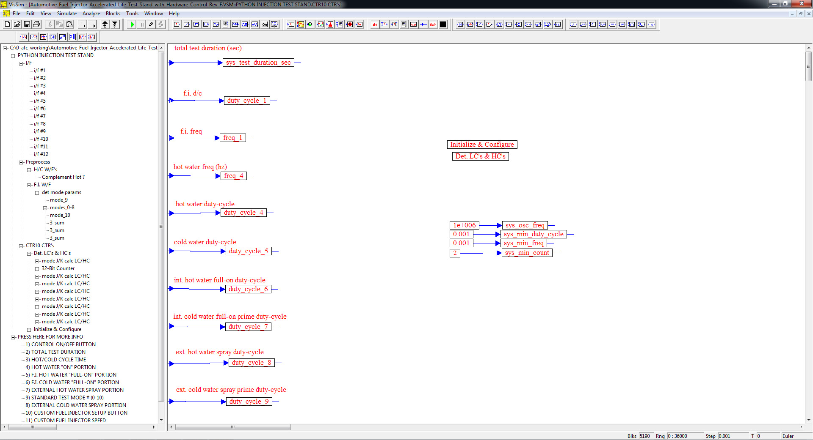

# ========================================
# Automotive Fuel Injector Accelerated Life Test Stand with Hardware Control using VISSIM:
# ========================================

## I. Top-Level Diagram:

## 
## 
## II. Test-Stand Information Sub-Model Level Diagram:

## 
## 
## III. Test-Stand Sub-Model Level Diagram:

## 
## 
## IV. Input Filter Sub-Model Level Diagram:

## 
## 
## V. PreProcess Sub-Model Level Diagram:

## 
## 
## VI. Fuel Injector #1 Input Filter Sub-Model Level Diagram:

## 
## 
## VII. Hot/Cold Water Control Sub-Model Level Diagram:

## 
## 
## VIII. CTR10 Counter (Hardware Control) Sub-Model Level Diagram:

## 
## 
## IX. CTR10 Counter Input Sub-Model Level Diagram:

## 
## 
## X. CTR10 Counter Calculations Sub-Model Level Diagram:

## 
## 
## XI. CTR10 Counter 32-Bit Counter Register Calculation Sub-Model Level Diagram:

## 
## *Note: Performance Data and Analysis performed using VISSIM, ( https://web.solidthinking.com/vissim-is-now-solidthinking-embed )